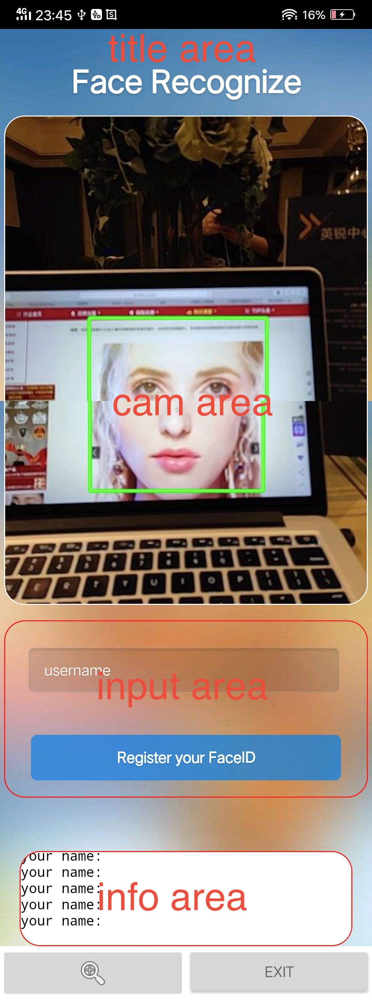
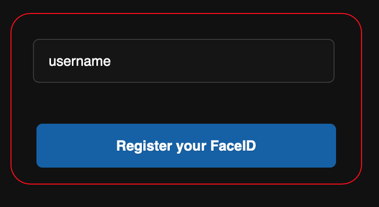
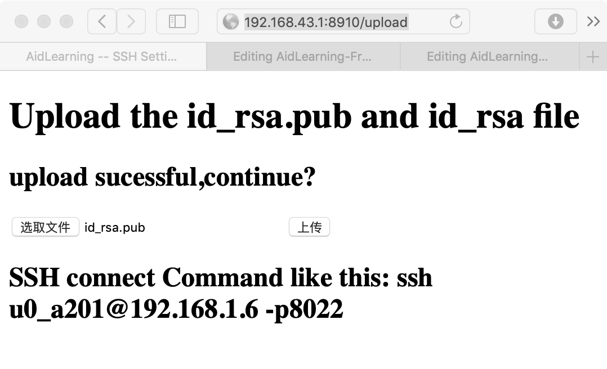

# AidLearnig  
 

AidLearning FrameWork is a Linux system with GUI running on Android phone for AI programming without needing root. Aidlearning is also a Python programming framwork for mobile devices. In addition to some of the features available in the Linux environment, AidLearning has supported GUI and neural network environments. For example, Caffe, Tensorflow, Mxnet,Gluoncv, ncnn, Keras,Pytorch are perfectly supported..   

  

AidLearning is a Linux system running on the Android with GUI, AI and  Python support . <a href="http://www.aidlearning.net" >The AidLearning </a> project which have the <b>Linux+Anroid+AI 3IN1</b> environments Developed and Maintained by  students from [CAS University](http://english.cas.cn) and [Yale University](https://www.yale.edu).

Built with simplicity in mind, <b>Aid Learning</b> 
    supports a list of Top Machine Learning Framework for Deep Learning. Now we support Caffe, Tensorflow, Mxnet, ncnn, Keras, Pytorch,Gluoncv, cv2,scipy.... powerfully.  

Furthermore we provide an AI coding develop tool named Aid_code. It can provide you a visual AI programming IDE by using Python from zero on our framework! It means that when it is installed, your Android phone owned a Linux system with GUI which can write and run AI program in it as same as in PC.

Now you have a complete linux with GUI running on Android (Real linux running on the busybox and not virtul environment. So it is faster and almost real-time.) and can write your AI code on it visually using the Python!
   

<b>New Release : AidLearning 0.70</b>
  What's new:
 
- Full support for Python 3 and python 2, as well as PIP3 and PIP2 install  
- Caffe/MXNET/Gluoncv/Tensorflow/ Keras/Pytorch/Opencv4
   for Python3 and Python2  are perfectly supported   
- With the new CVS package, you can easily customize your interface with Python code:
    
    cvs. setTitle ("Face Recognize") 
    cvs. setInput_dict (usr_dict) 
    cvs. setSubmitName ("Register your FaceID") 
    cvs. setCamX (350,480) 
    cvs. setInfoX (320,60) 
    
- Now You can use **apt (apt-get)** to install new packages to improve your Linux Environment...  
- Some BUGs have been solved, such as:
     Press the home key to return home and then enter the app: Instead of returning to the GUI, the problem is returning to the terminal. 
    Reducing dependence on network traffic. 
- Adding new buttons for running Python 3 and python 2 online for **Aid_code IDE**  
- Add the ***AI Example Center***, put some examples on the website, the new examples can be downloaded from the website in the future, in order to prevent the distribution of installation packages too large. 
- Modified accounts that do not activate the mailbox can be logged in **directly**, but there are prompts to activate the interface after login...
     
 

<h3><b><u>TABLE OF CONTENTS</u></b></h3>
<a href="#dependencies" >&#9635 Dependencies</a> 
<a href="#installation" >&#9635 Installation</a> 
<a href="#Support" >&#9635 Support AI framework</a> 
<a href="#GUI" >&#9635 GUI Customize</a> 
<a href="#ssh" >&#9635 SSH (connect to pc)</a> 
<a href="#customprediction" >&#9635 Custom Image Prediction</a> 
<a href="#documentation" >&#9635 Documentation</a> 
<a href="#sample" >&#9635 Projects Built on ImageAI</a> 
<a href="#recommendation" >&#9635 AI Practice Recommendations</a> 
<a href="#contact" >&#9635 Contact Developers</a> 
<a href="#contributors" >&#9635 Contributors</a> 
<a href="#ref" >&#9635 References</a> 

  

<h3><b><u>Dependencies</u></b></h3>All you need is an Android devices (phone ,tablet or arm board)  that supports the CPU of Arm64(aarch64). The Android version requires more than 6.0. If you think the parameters are not clear enough, I would like to say that most of the mainstream mobile phones support it, such as Samsung, Huawei, MI, OPPO, VIVO, etc.In addition, the requirement of storage space is a little big. It is suggested that there should be 4G free storage space.

 <h3><b><u>Installation</u></b></h3> To install AidLearing, Simply download an app (apk file) and install it on your mobile device. download at http://www.aidlearning.net/downloads/aidlux-05-31.apk  
 The  app （apk） is only 7M，when you install the apk ,the apk will download the depdence of the framework
is 700M and 350M examples of AI codes using python. all is about 1G size to download .So it's recommended that you install it in a WiFi environment.
  

<h3><b><u>Support AI Framework</u></b></h3>

---

* [Caffe]https://github.com/BVLC/caffe
* [Tensorflow]https://github.com/tensorflow/tensorflow
* [Mxnet]https://github.com/apache/incubator-mxnet
* [Keras]https://github.com/keras-team/keras
* [ncnn]https://github.com/Tencent/ncnn
* [pytorch]https://github.com/pytorch/pytorch
* [opencv]https://github.com/opencv/opencv

	

---

<h3><b><u>GUI Customize</u></b></h3>

          
<i><b>Now you can easily customize your GUI with Python code！</b></i>

<i>    
   cvs. setTitle ("Face Recognize") 
    cvs. setInput_dict (usr_dict) 
    cvs. setSubmitName ("Register your FaceID") 
    cvs. setCamX (350,480) 
    cvs. setInfoX (320,60) 
</i>

	

          
	

    
  

<b>AidLearnig</b> 

As shown in the figure above, we divide an app into four areas: Title area, camera area, input area, info show area. An app display can consist of one or more areas.You can use Python (cvs class) statements to manipulate the Title, size and layout of these areas.
for examples： in the info area ,you can do this: 
cvs. setInfoX (320,60) # setting the width,height of the info area 
cvs. infoshow ("this is info show") # show info in the info area 

In particular, input area, we greatly simplify the operation process, you only need to specify a dict, AidLeaning will automatically generate a form for you to interact with users, such as you need to register a face, you can do this:
  
usr_dict={'username': '', 'type': 'add_person'}# define the input list  
cvs.setInput_dict(usr_dict)# setting for gui  
cvs.setSubmitName("Register your FaceID")#setting the name of submit button  
so ,aidlearning will produce this gui:

<a href="imageai/Detection/VIDEO.md" ><button style="font-size: 20px; color: white; background-color: steelblue; height: 50px; border-radius: 10px; " > >>> Tutorial & Guide </button></a>

 

<h3><b><u>SSH (connect to PC) </u></b></h3>

 
PC can connect to mobile by using **ssh-keygen**. Generate a new key pair with <b>ssh-keygen</b> command in your PC.  the command ssh-keygen produce the file of id_rsa and id_rsa.pub in the dir: ~/.ssh/

Just need you do: open the url:mobilephone'sip:8910/upload(for example:http://192.168.1.6:8910/upload) in the pc to upload ssh's file(id_rsa and id_rsa.pub). 

<h3><b><u>Custom Image Prediction </u></b></h3>

<i>Prediction from a sample model trained on IdenProf, for predicting professionals</i>

      
    <pre>mechanic : 76.82620286941528
chef : 10.106072574853897
waiter : 4.036874696612358
police : 2.6663416996598244
pilot : 2.239348366856575</pre>

<b>ImageAI</b> provides classes and methods for you to run image prediction your own custom objects using your own model trained with <b>ImageAI</b> Model Training class.
You can use your custom models trained with SqueezeNet, ResNet50, InceptionV3 and DenseNet and the JSON file containing the mapping of the custom object names.
Click the link below to see the guide to sample training codes, explanations, and best practices guide.
 

<a href="imageai/Prediction/CUSTOMPREDICTION.md" ><button style="font-size: 20px; color: white; background-color: steelblue; height: 50px; border-radius: 10px; " > >>> Tutorials & Documentation </button></a>

  

<h3><b><u>Documentation </u></b></h3>

We have provided full documentation for all <b>ImageAI</b> classes and functions in 2 major languages. Find links below:  

<b> >> Documentation - English Version  [https://imageai.readthedocs.io](https://imageai.readthedocs.io)</b>  
<b> >> Documentation - Chinese Version  [https://imageai-cn.readthedocs.io](https://imageai-cn.readthedocs.io)</b>  
<b> >> Documentation - French Version  [https://imageai-fr.readthedocs.io](https://imageai-fr.readthedocs.io)</b>

   

<h3><b><u>Real-Time and High Performance Implementation</u></b></h3>
<b>ImageAI</b> provides abstracted and convenient implementations of state-of-the-art Computer Vision technologies. All of <b>ImageAI</b> implementations and code can work on any computer system with moderate CPU capacity. However, the speed of processing for operations like image prediction, object detection and others on CPU is slow and not suitable for real-time applications. To perform real-time Computer Vision operations with high performance, you need to use GPU enabled technologies.
   
<b>ImageAI</b> uses the Tensorflow backbone for it's Computer Vision operations. Tensorflow supports both CPUs and GPUs ( Specifically NVIDIA GPUs.  You can get one for your PC or get a PC that has one) for machine learning and artificial intelligence algorithms' implementations. To use Tensorflow that supports the use of GPUs, follow the link below :
   
FOR WINDOWS  
<a href="https://www.tensorflow.org/install/install_windows" >https://www.tensorflow.org/install/install_windows</a>   

FOR macOS  
<a href="https://www.tensorflow.org/install/install_mac" >https://www.tensorflow.org/install/install_mac</a>   

FOR UBUNTU  
<a href="https://www.tensorflow.org/install/install_linux">https://www.tensorflow.org/install/install_linux</a>
  

<h3><b><u>Sample Applications</u></b></h3> As a demonstration of  what you can do with ImageAI, we have 
 built a complete AI powered Photo gallery for Windows called <b>IntelliP</b> ,  using <b>ImageAI</b> and UI framework <b>Kivy</b>. Follow this 
 <a href="https://github.com/OlafenwaMoses/IntelliP"  > link </a> to download page of the application and its source code.    

 We also welcome submissions of applications and systems built by you and powered by ImageAI for listings here. Should you want your ImageAI powered 
  developments listed here, you can reach to us via our <a href="#contact" >Contacts</a> below.

    

 <h3><b><u>AI Practice Recommendations</u></b></h3>

 For anyone interested in building AI systems and using them for business, economic,  social and research purposes, it is critical that the person knows the likely positive, negative and unprecedented impacts the use of such technologies will have. They must also be aware of approaches and practices recommended by experienced industry experts to ensure every use of AI brings overall benefit to mankind. We therefore recommend to everyone that wishes to use ImageAI and other AI tools and resources to read Microsoft's January 2018 publication on AI titled "The Future Computed : Artificial Intelligence and its role in society ".
Kindly follow the link below to download the publication.
   
<a href="https://blogs.microsoft.com/blog/2018/01/17/future-computed-artificial-intelligence-role-society/" >https://blogs.microsoft.com/blog/2018/01/17/future-computed-artificial-intelligence-role-society/</a>
    

 <h3><b><u>Contact Developers</u></b></h3>
 
 <b>Moses Olafenwa</b>  
    <i>Email: </i>    <a style="text-decoration: none;"  href="mailto:guymodscientist@gmail.com"> guymodscientist@gmail.com</a>  
      <i>Website: </i>    <a style="text-decoration: none;" target="_blank" href="https://moses.aicommons.science"> https://moses.aicommons.science</a>  
      <i>Twitter: </i>    <a style="text-decoration: none;" target="_blank" href="https://twitter.com/OlafenwaMoses"> @OlafenwaMoses</a>  
      <i>Medium : </i>    <a style="text-decoration: none;" target="_blank" href="https://medium.com/@guymodscientist"> @guymodscientist</a>  
      <i>Facebook : </i>    <a style="text-decoration: none;" target="_blank" href="https://facebook.com/moses.olafenwa"> moses.olafenwa</a>  
  
      <b>John Olafenwa</b>  
    <i>Email: </i>    <a style="text-decoration: none;"  href="mailto:johnolafenwa@gmail.com"> johnolafenwa@gmail.com</a>  
      <i>Website: </i>    <a style="text-decoration: none;" target="_blank" href="https://john.aicommons.science"> https://john.aicommons.science</a>  
      <i>Twitter: </i>    <a style="text-decoration: none;" target="_blank" href="https://twitter.com/johnolafenwa"> @johnolafenwa</a>  
      <i>Medium : </i>    <a style="text-decoration: none;" target="_blank" href="https://medium.com/@johnolafenwa"> @johnolafenwa</a>  
      <i>Facebook : </i>    <a style="text-decoration: none;" href="https://facebook.com/olafenwajohn"> olafenwajohn</a>  

 

   

 <h3><b><u>Contributors</u></b></h3>
We are inviting anyone who wishes to contribute to the <b>ImageAI</b> project to reach to us. We primarily need contributions in translating the documentation of the project's code to major languages that includes but not limited to French, Spanish, Portuguese, Arabian and more. We want every developer and researcher around the world to benefit from this project irrespective of their native languages.  

We give special thanks to <b>[Kang vcar](https://github.com/kangvcar/)</b> for his incredible and excellent work in translating <b>ImageAI</b>'s documentation to the Chinese language. Find below the contact details of those who have contributed immensely to the <b>ImageAI</b> project.

 
 <b>Kang vcar</b>  
    <i>Email: </i>    <a style="text-decoration: none;"  href="mailto:kangvcar@mail.com"> kangvcar@mail.com</a>  
      <i>Website: </i>    <a style="text-decoration: none;" target="_blank" href="http://www.kangvcar.com"> http://www.kangvcar.com</a>  
      <i>Twitter: </i>    <a style="text-decoration: none;" target="_blank" href="https://twitter.com/kangvcar"> @kangvcar</a>  

 

  

 

 <h3><b><u>References</u></b></h3>

 1. Somshubra Majumdar, DenseNet Implementation of the paper, Densely Connected Convolutional Networks in Keras  
 <a href="https://github.com/titu1994/DenseNet/" >https://github.com/titu1994/DenseNet/</a>   

 2. Broad Institute of MIT and Harvard, Keras package for deep residual networks  
 <a href="https://github.com/broadinstitute/keras-resnet" >https://github.com/broadinstitute/keras-resnet</a>   

 3. Fizyr, Keras implementation of RetinaNet object detection  
 <a href="https://github.com/fizyr/keras-retinanet" >https://github.com/fizyr/keras-retinanet</a>   

 4. Francois Chollet, Keras code and weights files for popular deeplearning models  
 <a href="https://github.com/fchollet/deep-learning-models" >https://github.com/fchollet/deep-learning-models</a>   

 5. Forrest N. et al, SqueezeNet: AlexNet-level accuracy with 50x fewer parameters and <0.5MB model size  
 <a href="https://arxiv.org/abs/1602.07360" >https://arxiv.org/abs/1602.07360</a>   

 6. Kaiming H. et al, Deep Residual Learning for Image Recognition  
 <a href="https://arxiv.org/abs/1512.03385" >https://arxiv.org/abs/1512.03385</a>   

 7. Szegedy. et al, Rethinking the Inception Architecture for Computer Vision  
 <a href="https://arxiv.org/abs/1512.00567" >https://arxiv.org/abs/1512.00567</a>   

 8. Gao. et al, Densely Connected Convolutional Networks  
 <a href="https://arxiv.org/abs/1608.06993" >https://arxiv.org/abs/1608.06993</a>   

 9. Tsung-Yi. et al, Focal Loss for Dense Object Detection  
 <a href="https://arxiv.org/abs/1708.02002" >https://arxiv.org/abs/1708.02002</a>   
 
 10. O Russakovsky et al, ImageNet Large Scale Visual Recognition Challenge  
 <a href="https://arxiv.org/abs/1409.0575" >https://arxiv.org/abs/1409.0575</a>   
 
 11. TY Lin et al, Microsoft COCO: Common Objects in Context  
 <a href="https://arxiv.org/abs/1405.0312" >https://arxiv.org/abs/1405.0312</a>   
 
 12. Moses & John Olafenwa, A collection of images of identifiable professionals. 
 <a href="https://github.com/OlafenwaMoses/IdenProf" >https://github.com/OlafenwaMoses/IdenProf</a>   
 
 13. Joseph Redmon and Ali Farhadi, YOLOv3: An Incremental Improvement. 
 <a href="https://arxiv.org/abs/1804.02767" >https://arxiv.org/abs/1804.02767</a>   
