<p align=center>
	
	<h3 align="center">AidLearning </a></h3>
</p>

  <p align="center">
    Linux+AI+Python+Gui 4in1 Environments Running on the Android . <a href='intr.md'>[中文版]</a> <a href='README.md'>[English]
  </p>
  <p align="center">
    <a href="https://travis-ci.org/lc-soft/LCUI"></a>
    
    <a href="http://opensource.org/licenses/MIT"></a>
    <a href="https://github.com/aidlearning/AidLearning-FrameWork/releases">
     </a>
    
    


	
  </p>
</p>

 **AidLearning** is a Linux system running on the Android with GUI, Deep-Learning and  Python Visual Programming support . The [AidLearning](http://www.aidlearning.net) framework which have the <b>Linux+Android+AI+Python 4in1</b> environments Developed and Maintained by several students from [Cas University](http://english.cas.cn) and [Yale University](https://www.yale.edu).
 
 ### Table of Contents
- <a href='#Introduce'>⚘ introduce</a>
- <a href='#Dependencies'>⚘ Dependencies</a>
- <a href='#Installation'>⚘ Installation</a>
- <a href='#Support'>⚘ Support Powerfully</a>
- <a href='#Touch_and_Drag_Programming'>⚘ Touch and Drag Style Programming </a>
- <a href='#SSH'>⚘ SSH (pc connected)</a>
- <a href='#Aid_code'>⚘ Aid_code IDE of python</a>
- <a href='#Examples'>⚘ Examples inside</a>
- <a href='#references'>⚘ References</a>

# Introduce

[](license.md) 

AidLearning App builds a ***graphical interface Linux*** system (without need root) **on Android phones** and coexists with your Android system.  The App has a built-in system of leading deep learning frameworks, including ***Caffe, Tensorflow, Mxnet, pytorch, keras, ncnn and opencv***. You no longer need complex configuration, wall-turning downloads and Install dependency packages.


AidLearning is also a ***pocket AI programming tool***. The built-in AICode visual IDE allows you to easily program on your mobile phone with Python (supporting Python 2 and Python 3), support ***touch-and-drag*** interface design, support real-time debugging and graphical running of codes. AidLearning has a large number of AI source code examples, which include face recognition, pose recognition and classification. You can develop the AI App on mobile phones on a ***zero-based*** basis.

In addition, AidLearning provides wifi-based mapping projection technology, which can project mobile phone code to PC for Web interactive programming and ***SSH*** remote command interaction.  Easy viewing on televisions and the ability to projector for large screen display, ensures the ability to present in group settings.


In short, AidLearning has created a touch-and-drag programming platform for rapid development and learning that combines ***Android + Linux + AI  3IN1 environments***. It utilizes mobile phones for fragmented programming and fully optimizes use of the development advantages of the two major operating systems (Android + Linux) and the perfect terminal advantages of mobile phones. AidLearning  offers a distinct advantage to its users through an effective new platform for programming learning and development.

AidLearning App在Android手机上构建了一个带图形界面的Linux系统(不需要root)，和你的Android系统共生共存，并内置了目前排名top7的深度学习框架包括Caffe、Tensorflow、Mxnet、pytorch、keras、ncnn、opencv，你不再需要复杂的配置和翻墙安装依赖包。

AidLearning同时是一款口袋AI编程工具，内置的AiCode可视化编程器，可以让你在手机上用python（同时支持Python2和Python3）轻松零基础编程，支持触摸拖拽式界面设计 ，支持代码实时调试和图形化运行。Aid Learning内置大量人脸识别、行为识别、分类等AI源码例子程序，你可以零基础在手机上开发AI App。

此外，Aid Learning提供了基于wifi的映射投屏技术，可以把手机的代码投屏到电脑pc进行web互动编程和SSH远程命令交互，同时也可投影到电视机、投影仪进行大屏显示。

总之，Aid Learning打造了一个Android+Linux+AI 三合一的触摸拖拽式的快速开发和学习平台，不仅可利用手机进行碎片式编程，同时可充分利用两大主流操作系统（Android+Linux）的开发优势和手机的完美终端优势，利用这种优势，Aid Learning打造了一个完美的编程学习和开发的新平台。

[更多中文介绍请参考!]（https://www.jianshu.com/u/d319e817a013)


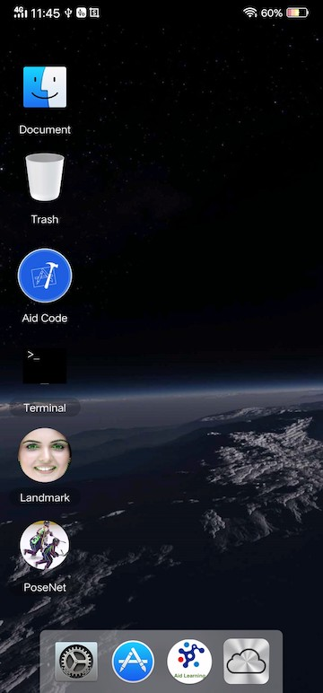

## Dependencies

All you need is an Android devices (phone ,tablet or arm board)  that supports the CPU of **Arm64(aarch64)**. The Android version requires more than 6.0. If you think the parameters are not clear enough, I would like to say that most of the mainstream mobile phones support it, such as _Samsung, Huawei, MI, OPPO, VIVO, nubia_ etc. In addition, the requirement of storage space is a little big. It is suggested that there should be **2G** free storage space.

## Installation

To install **AidLearing**, Simply download an App (apk file) and install it on your mobile device. download newest version at :
[ Download v0.76 now!](http://www.aidlearning.net/downloads/aidlux-09-04.apk)  
Other version at:[https://github.com/aidlearning/AidLearning-FrameWork/releases](https://github.com/aidlearning/AidLearning-FrameWork/releases)
 
The  APP （apk） is only 9M，when you install the apk  and launch,the apk will auto download the dependence of the linux and examples of codes . all is about 1G size to download .So it's recommended that you install it _in a wifi environment_.

**Important reminder:**  Click the setting icon after entering the desktop, the dialog box for the camera permission will pop up, please click agree, if you want to use the built-in examples.<br>

[Download v0.76 for chinese version now!](http://www.aidlearning.net/downloads/aidlux-09-04.apk)  


## Support
---
Support AI Framework:
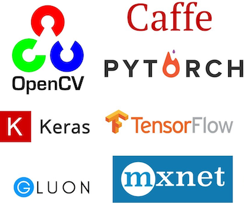
  * [Caffe]https://github.com/BVLC/caffe
  * [Tensorflow]https://github.com/tensorflow/tensorflow
  * [Mxnet]https://github.com/apache/incubator-mxnet
  * [Keras]https://github.com/keras-team/keras
  * [ncnn]https://github.com/Tencent/ncnn
  * [pytorch]https://github.com/pytorch/pytorch
  * [opencv]https://github.com/opencv/opencv
---

Support Python2.7 and Python3.6.4:

| AidLearning      | Python2.7    |  Python3.6|
| --------- | -------- | -----: | 
| caffe    | ✓1.0.0 | ✓ 1.0.0| 
| mxnet     | ✓1.0.0     |   ✓1.5.0 | 
| tensorflow     | ✓1.10.0     |   ✓1.5.0 | 
| Gluoncv     | ✗  | ✓ 0.40|
| Keras | ✓2.2.4 | ✓2.2.4 |
| Pytorch |  ✗ | ✓1.1.0 |
| Opencv(cv2) | ✓2.4.9 | ✓3.4.6 |
| Scipy | ✓0.18.1 | ✓1.3.0 |
| Numpy | ✓1.14.5 | ✓1.16.3 |

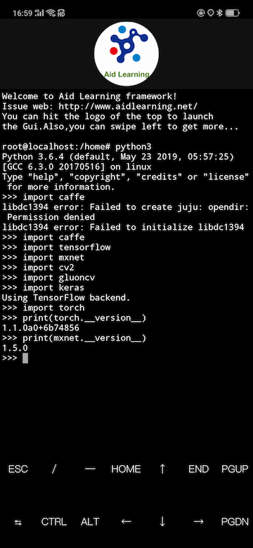

## Touch_and_Drag_Programming 

Now you can easily customize your GUI with touch and drag using wizard！Wizard will produce the code automatic like this:

```
class MyApp(App):
 	def __init__(self, *args):
  		super(MyApp, self).__init__(*args)

	def main(self):
		container = gui.VBox(width=120, height=100)
		self.lbl = gui.Label('Hello world!')
		self.bt = gui.Button('Press me!')

	    # setting the listener for the onclick event of the button
		self.bt.onclick.do(self.on_button_pressed)

	    # appending a widget to another, the first argument is a string key
		container.append(self.lbl)
		container.append(self.bt)

	    # returning the root widget
		return container

        #listener function
	def on_button_pressed(self, widget):
		self.lbl.set_text('Button pressed!')
		self.bt.set_text('Hi!')
```

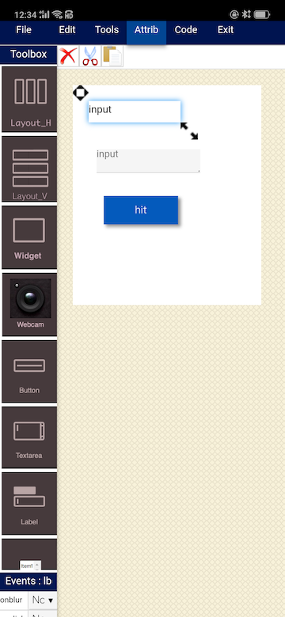
<p align=center>

</p>

更多请阅读[Wizard-触摸拖拽式设计你的界面](https://github.com/aidlearning/AidLearning-FrameWork/blob/master/gui_wizard/README.md)

## SSH
* PC can connect to mobile by using **ssh-keygen**. Generate a new key pair with <b>ssh-keygen</b> command in your PC.  the command ssh-keygen produce the file of id_rsa and id_rsa.pub in the dir: ~/.ssh/

* Just need you do: open the url:mobilephone'sip:8910/upload(for example:http://192.168.1.6:8910/upload)  on the pc to upload ssh's file(id_rsa and id_rsa.pub). 

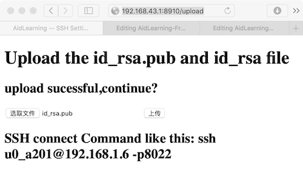

* upload finished , just restart the app on the android ,open the terminal the type this command like this to connect:

```
ssh u0_a311@192.168.1.6 -p8022
```

## Aid_code

* We provide an AI coding develop tool named **Aid_code**. It can provide you a visual AI programming IDE by using Python from zero on our framework! Using the tool, you can run your python2 or python3 codes online. So ,you can coding with Aid_code IDE on your phone anywhere, anytime. 


* Of course, you can use Aid_code on the web to edit your code online. For example, you can use web coding with Aid_code on PC. You just need to open the web address: IP of your mobile phone:8900/, when your PC and mobile phone are in the same LAN.
You can open it on a PC, for example:
http://192.168.1.8:8900/
assume your phone's IP is 192.168.1.8, you can check your phone's IP by commanding ifconfig (run ifconfig command under terminal)
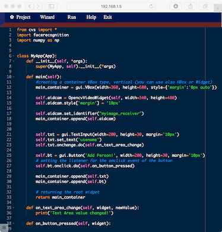
* code IntelliSense: New code auto-prompting function, if you input the initial letters of variables, functions and keywords, the system will <b>automatically complete</b> , which can greatly improve efficiency.
	<p align=center>
          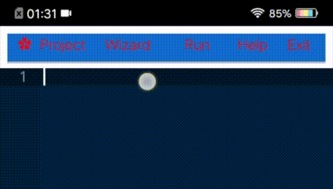
	</p>

深入了解Gui开发原理请阅读[cvs-强大的图形界面开发包](https://github.com/aidlearning/AidLearning-FrameWork/blob/master/gui_cvs/README.md)

## Files transfer

* The sdcard directory on your Android phone has been mapped to the / sdcard directory under AidLearning

* If you install QQ Instant Messaging Tool, the file directory transferred through QQ is mapped to / sdcard / Tencent / QQfile_recv / directory.


* **Most Easy way:**
 You just need to open the web address: IP of your mobile phone:8080/, when your PC and mobile phone are in the same LAN.
You can open it on a PC, for example:
http://192.168.1.8:8080/
then hit the upload button to upload the pc file to your mobile,or hit the download button to download the files of mobile to the pc.
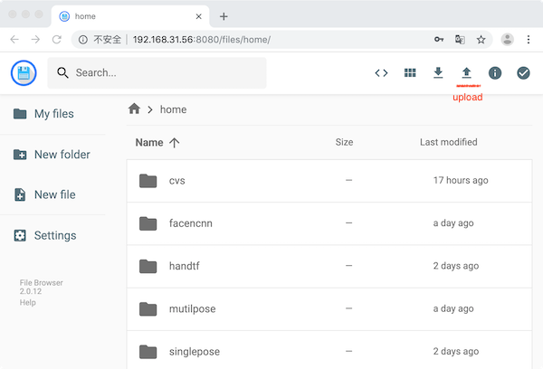

## Examples
---Examples inside
* Facencnn(mobiefacenet ncnn) 15fps in mobile phone (99.83% in LFW)
* Face Landmark (106 keypoints ncnn) 15fps  in mobile phone
* handpose (tensorflow ) 5fps  in mobile phone
* body posenet for single person(converted from google ) 10fps  in mobile phone
* body posenet for multi-person(converted from google ) 7fps  in mobile phone
* Stylized picture(GAN ) 3fps in mobile phone

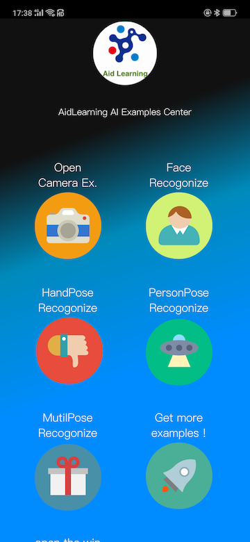
<p align=left>
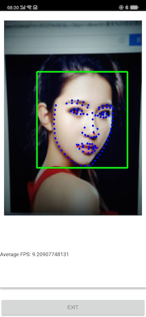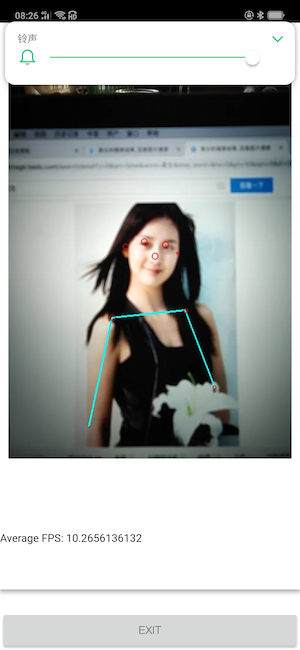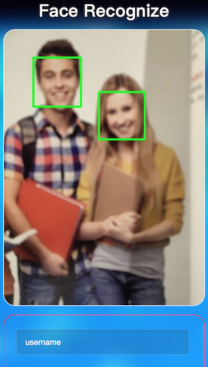
</p>

## Privacy Policy
* Additional camera-based (camera) features: You can use this additional feature to capture camera video frames, making it easier to run python programs and view running results.
* Mobile storage access: Our platform will read the package downloaded from the mobile phone, and users can download and use more third-party package.

## References

* VTE (libvte): Terminal emulator widget for GTK+, mainly used in gnome-terminal. [Source](https://github.com/GNOME/vte), [Open Issues](https://bugzilla.gnome.org/buglist.cgi?quicksearch=product%3A%22vte%22+), and [All (including closed) issues](https://bugzilla.gnome.org/buglist.cgi?bug_status=RESOLVED&bug_status=VERIFIED&chfield=resolution&chfieldfrom=-2000d&chfieldvalue=FIXED&product=vte&resolution=FIXED).
* iTerm 2: OS X terminal application. [Source](https://github.com/gnachman/iTerm2), [Issues](https://gitlab.com/gnachman/iterm2/issues) and [Documentation](http://www.iterm2.com/documentation.html) (which includes [iTerm2 proprietary escape codes](http://www.iterm2.com/documentation-escape-codes.html)).
* Konsole: KDE terminal application. [Source](https://projects.kde.org/projects/kde/applications/konsole/repository), in particular [tests](https://projects.kde.org/projects/kde/applications/konsole/repository/revisions/master/show/tests), [Bugs](https://bugs.kde.org/buglist.cgi?bug_severity=critical&bug_severity=grave&bug_severity=major&bug_severity=crash&bug_severity=normal&bug_severity=minor&bug_status=UNCONFIRMED&bug_status=NEW&bug_status=ASSIGNED&bug_status=REOPENED&product=konsole) and [Wishes](https://bugs.kde.org/buglist.cgi?bug_severity=wishlist&bug_status=UNCONFIRMED&bug_status=NEW&bug_status=ASSIGNED&bug_status=REOPENED&product=konsole).
* hterm: JavaScript terminal implementation from Chromium. [Source](https://github.com/chromium/hterm), including [tests](https://github.com/chromium/hterm/blob/master/js/hterm_vt_tests.js), and [Google group](https://groups.google.com/a/chromium.org/forum/#!forum/chromium-hterm).
* xterm: The grandfather of terminal emulators. [Source](http://invisible-island.net/datafiles/release/xterm.tar.gz).
* Connectbot: Android SSH client. [Source](https://github.com/connectbot/connectbot)
* Android Terminal Emulator: Android terminal app which Termux terminal handling is based on. Inactive. [Source](https://github.com/jackpal/Android-Terminal-Emulator).
* Termux: Android terminal and Linux environment - app repository. [Source](https://github.com/termux/termux-app).
* remi:Python REMote Interface library. Platform independent. In about 100 Kbytes, perfect for your diet.[Source]
(https://github.com/dddomodossola/remi).
* [Caffe]https://github.com/BVLC/caffe
* [Tensorflow]https://github.com/tensorflow/tensorflow
* [Mxnet]https://github.com/apache/incubator-mxnet
* [Keras]https://github.com/keras-team/keras
* [ncnn]https://github.com/Tencent/ncnn
* [pytorch]https://github.com/pytorch/pytorch
* [opencv]https://github.com/opencv/opencv
