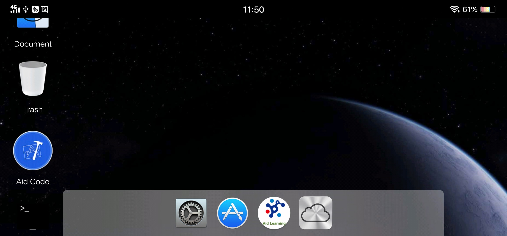
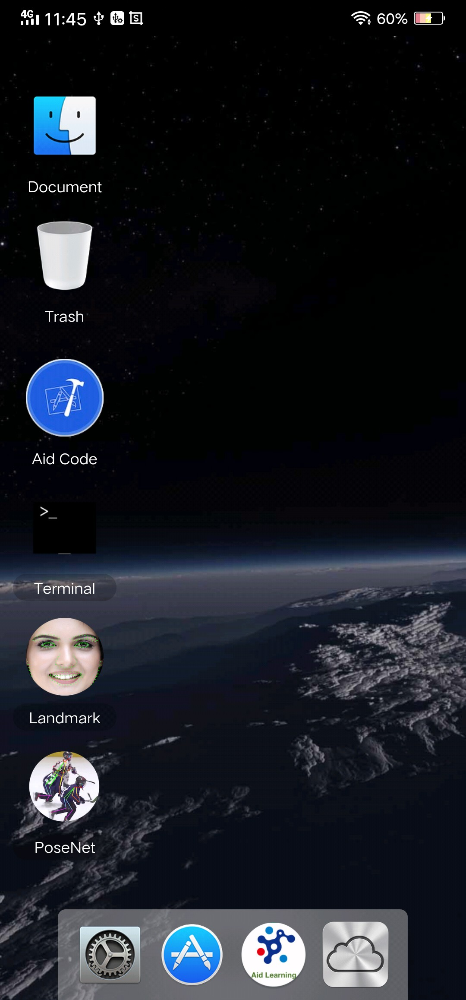

# AidLearning-FrameWork
Aid Learning FrameWork is a Linux system running on Android phone for AI programming. It means that when it is installed, your Android phone owned a Linux system which can run AI program in it. Now we support Caffe, Tensorflow, Mxnet, ncnn, Keras, cv2, Git/SSH powerfully. 

Furthermore we provide an AI coding develop tool named Aid_code. It can provide you a visual AI programming experience by using Python from zero on our framework!

Now you have a complete linux with a GUI running on Android (Real linux running on the busybox and not virtul environment. So it is faster and almost real-time.) and can tap your AI code on it visually!

	

# Face landmark (106 keypoints) Inside!

Fast:already converted to ncnn,so it is fast and multi-threads.
15 fps running on the mobile with NO tracking!  

# Network:

Input            data                             0 1 data
Convolution      conv1                            1 1 data conv1 0=32 1=3 11=3 5=1 6=864
BatchNorm        bn1                              1 1 conv1 bn1 0=32
PReLU            prelu1                           1 1 bn1 prelu1 0=32
ConvolutionDepthWise conv2_dw                         1 1 prelu1 conv2_dw 0=32 1=2 11=2 5=1 6=128 7=32
BatchNorm        bn2_dw                           1 1 conv2_dw bn2_dw 0=32
PReLU            prelu2_dw                        1 1 bn2_dw prelu2_dw 0=32
Convolution      conv2_sep                        1 1 prelu2_dw conv2_sep 0=32 1=1 11=1 5=1 6=1024
BatchNorm        bn2_sep                          1 1 conv2_sep bn2_sep 0=32
PReLU            prelu2_sep                       1 1 bn2_sep prelu2_sep 0=32
ConvolutionDepthWise conv3_dw                         1 1 prelu2_sep conv3_dw 0=32 1=3 11=3 3=2 13=2 5=1 6=288 7=32
BatchNorm        bn3_dw                           1 1 conv3_dw bn3_dw 0=32
PReLU            prelu3_dw                        1 1 bn3_dw prelu3_dw 0=32
Convolution      conv3_sep                        1 1 prelu3_dw conv3_sep 0=64 1=1 11=1 5=1 6=2048
BatchNorm        bn3_sep                          1 1 conv3_sep bn3_sep 0=64
PReLU            prelu3_sep                       1 1 bn3_sep prelu3_sep 0=64
ConvolutionDepthWise conv4_dw                         1 1 prelu3_sep conv4_dw 0=64 1=2 11=2 5=1 6=256 7=64
BatchNorm        bn4_dw                           1 1 conv4_dw bn4_dw 0=64
PReLU            prelu4_dw                        1 1 bn4_dw prelu4_dw 0=64
Convolution      conv4_sep                        1 1 prelu4_dw conv4_sep 0=64 1=1 11=1 5=1 6=4096
BatchNorm        bn4_sep                          1 1 conv4_sep bn4_sep 0=64
PReLU            prelu4_sep                       1 1 bn4_sep prelu4_sep 0=64
ConvolutionDepthWise conv5_dw                         1 1 prelu4_sep conv5_dw 0=64 1=3 11=3 3=2 13=2 5=1 6=576 7=64
BatchNorm        bn5_dw                           1 1 conv5_dw bn5_dw 0=64
PReLU            prelu5_dw                        1 1 bn5_dw prelu5_dw 0=64
Convolution      conv5_sep                        1 1 prelu5_dw conv5_sep 0=64 1=1 11=1 5=1 6=4096
BatchNorm        bn5_sep                          1 1 conv5_sep bn5_sep 0=64
PReLU            prelu5_sep                       1 1 bn5_sep prelu5_sep 0=64
ConvolutionDepthWise conv6_dw                         1 1 prelu5_sep conv6_dw 0=64 1=2 11=2 5=1 6=256 7=64
BatchNorm        bn6_dw                           1 1 conv6_dw bn6_dw 0=64
PReLU            prelu6_dw                        1 1 bn6_dw prelu6_dw 0=64
Convolution      conv6_sep                        1 1 prelu6_dw conv6_sep 0=64 1=1 11=1 5=1 6=4096
BatchNorm        bn6_sep                          1 1 conv6_sep bn6_sep 0=64
PReLU            prelu6_sep                       1 1 bn6_sep prelu6_sep 0=64
ConvolutionDepthWise conv7_dw                         1 1 prelu6_sep conv7_dw 0=64 1=3 11=3 3=2 13=2 5=1 6=576 7=64
BatchNorm        bn7_dw                           1 1 conv7_dw bn7_dw 0=64
PReLU            prelu7_dw                        1 1 bn7_dw prelu7_dw 0=64
Convolution      conv7_sep                        1 1 prelu7_dw conv7_sep 0=128 1=1 11=1 5=1 6=8192
BatchNorm        bn7_sep                          1 1 conv7_sep bn7_sep 0=128
PReLU            prelu7_sep                       1 1 bn7_sep prelu7_sep 0=128
ConvolutionDepthWise conv8_dw                         1 1 prelu7_sep conv8_dw 0=128 1=2 11=2 5=1 6=512 7=128
BatchNorm        bn8_dw                           1 1 conv8_dw bn8_dw 0=128
PReLU            prelu8_dw                        1 1 bn8_dw prelu8_dw 0=128
Convolution      conv8_sep                        1 1 prelu8_dw conv8_sep 0=128 1=1 11=1 5=1 6=16384
BatchNorm        bn8_sep                          1 1 conv8_sep bn8_sep 0=128
PReLU            prelu8_sep                       1 1 bn8_sep prelu8_sep 0=128
ConvolutionDepthWise conv9_dw                         1 1 prelu8_sep conv9_dw 0=128 1=3 11=3 3=2 13=2 5=1 6=1152 7=128
BatchNorm        bn9_dw                           1 1 conv9_dw bn9_dw 0=128
PReLU            prelu9_dw                        1 1 bn9_dw prelu9_dw 0=128
Convolution      conv9_sep                        1 1 prelu9_dw conv9_sep 0=256 1=1 11=1 5=1 6=32768
BatchNorm        bn9_sep                          1 1 conv9_sep bn9_sep 0=256
PReLU            prelu9_sep                       1 1 bn9_sep prelu9_sep 0=256
ConvolutionDepthWise conv10_dw                        1 1 prelu9_sep conv10_dw 0=256 1=2 11=2 5=1 6=1024 7=256
BatchNorm        bn10_dw                          1 1 conv10_dw bn10_dw 0=256
PReLU            prelu10_dw                       1 1 bn10_dw prelu10_dw 0=256
Convolution      conv10_sep                       1 1 prelu10_dw conv10_sep 0=256 1=1 11=1 5=1 6=65536
BatchNorm        bn10_sep                         1 1 conv10_sep bn10_sep 0=256
PReLU            prelu10_sep                      1 1 bn10_sep prelu10_sep 0=256
ConvolutionDepthWise conv11_dw                        1 1 prelu10_sep conv11_dw 0=256 1=3 11=3 5=1 6=2304 7=256
BatchNorm        bn11_dw                          1 1 conv11_dw bn11_dw 0=256
PReLU            prelu11_dw                       1 1 bn11_dw prelu11_dw 0=256
Convolution      conv11_sep                       1 1 prelu11_dw conv11_sep 0=256 1=1 11=1 5=1 6=65536
BatchNorm        bn11_sep                         1 1 conv11_sep bn11_sep 0=256
PReLU            prelu11_sep                      1 1 bn11_sep prelu11_sep 0=256
InnerProduct     conv6_3                          1 1 prelu11_sep conv6_3 0=212 1=1 2=54272
BatchNorm        bn6_3                            1 1 conv6_3 bn6_3 0=212

# Download the framework and install (free!)
the example of landmark is inside the AidLearning Framework. 
[!Download now](http://www.aidlearning.net/downloads/aidlux-07-04.apk)(for python2.7 and python3.6.4) 
