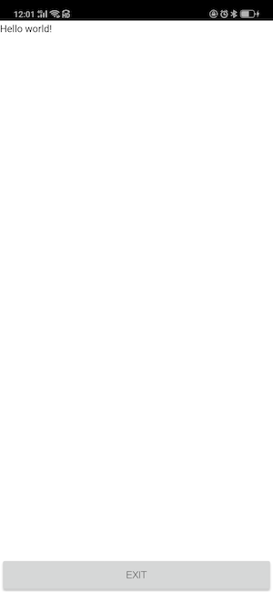

# *cvs-强大的图形界面开发包*
我们重写了cvs包用来在手机端对gui的显示和设计，同时cvs继承了cv2（opencv for python）包和remi（python的跨平台的gui库）包的大部分功能，以下是cvs包的介绍：

# 怎么使用：

```python
from cvs import *
```

# 包里有什么

| 函数名和变量      | 继承    |  参数 | 作用 |返回
| --------| ----- | -----: | --: |--:|
| imread    | cv2  | same as cv2 |读一张图|mat图片数据
| read     |  cv2 |same as cv2 |读一帧图 |mat图像数据
| imshow     | cv2 |same as cv2 |显示图片 |
| VideoCapture | cv2|same as cv2| 打开摄像头|返回cam
|openwin| custom |无 |打开一个窗体 | 无  |
|rectangle|cv2|same as cv2 |画矩形 |无   |
|line|cv2 |same as cv2 |画直线 |无   |
|circle |cv2 |same as cv2 |画椭圆 |无   |
|putText|cv2 |same as cv2 |在图像上写字 |无   |
|GaussianBlur|cv2|same as cv2 |高斯模糊|mat图像数据
|flip|cv2|same as cv2 |图像反转|mat图像数据
|resize|cv2|same as cv2 |缩放图像尺寸|mat图像数据
|setLbs|custom|str |传递str参数 |无 |
|getLbs|custom| 无 |传递str参数| str  |
|waitKey|cv2 |same as cv2 |等待延迟| 无  |
|sleep|custom | 毫秒数| 等待延迟  |无
|initcv|custom |函数名| 初始化处理线程|无   |
|startcv|remi |gui的类名|启动gui界面 | 无  |
|App|remi |--| 用于ui设计和显示 |无
|gui|remi |--| ui控件类    | 无  |

# 简短教程：

首先，导入cvs包
Import cvs library and some other useful stuff.

```py
from cvs import *
```

其次，定义一个子类继承“app”类，并声明一个“main”函数，该函数将成为应用程序的入口点。在主函数内部，您必须<code>return</code> the root widget。

Subclass the `App` class and declare a `main` function that will be the entry point of the application. Inside the main function you have to <code>return</code> the root widget.

```py
class MyApp(App):
    def __init__(self, *args):
        super(MyApp, self).__init__(*args)

    def main(self):
        lbl = gui.Label("Hello world!", width=100, height=30)

        # return of the root widget
        return lbl
```

最后，在主类之外，调用initcv(cvs.openwin)初始化窗口，调用函数“startcv”启动应用程序，并将前面声明的类的名称作为参数传递。

Outside the main class start the application calling the function `startcv` passing as parameter the name of the class you declared previously.

```py
# starts the gui
initcv（cvs.openwin）
startcv(MyApp)
```

Run the script，显示如下：



# 常见用法：

```python
from cvs import *

class MyApp(App):
    def __init__(self, *args):
        super(MyApp, self).__init__(*args)

    def main(self):
        container = gui.VBox(width=220, height=200)
        self.lbl = gui.Label('Hello world!')
        self.bt = gui.Button('Press me!')

        # setting the listener for the onclick event of the button
        self.bt.onclick.do(self.on_button_pressed)

        # appending a widget to another, the first argument is a string key
        container.append(self.lbl)
        container.append(self.bt)

        # returning the root widget
        return container

    # listener function
    def on_button_pressed(self, widget):
        self.lbl.set_text('Button pressed!')
        self.bt.set_text('Hi!')

# starts gui
initcv(cvs.openwin)
startcv(MyApp)
```

这个例子先构建一个容器（container，类似与Android studio里的Layout），然后在容器里添加了按钮和文本显示控件，并且定义了一个消息用于处理按钮按下来的情况。显示如下：


点击后显示如下：


Widgets公开了在用户交互期间发生的一组事件。这些事件是定义应用程序行为的一种方便方法。每个Widgets都有自己的回调，这取决于它允许的用户交互类型。稍后将说明Widgets的具体回调。

为了将函数注册为事件侦听器，您必须调用一个像eventname.do（即onclick.do）这样的函数，该函数将作为参数传递将管理事件的回调。

# Event 和callbacks的例子：

```python
from cvs import *

class MyApp(App):
    def __init__(self, *args):
        super(MyApp, self).__init__(*args)

    def main(self):
        container = gui.VBox(width=120, height=100)
        self.lbl = gui.Label('Hello world!')
        self.bt = gui.Button('Hello name!')
        self.bt2 = gui.Button('Hello name surname!')

        # setting the listener for the onclick event of the buttons
        self.bt.onclick.do(self.on_button_pressed, "Name")
        self.bt2.onclick.do(self.on_button_pressed, "Name", "Surname")

        # appending a widget to another
        container.append(self.lbl)
        container.append(self.bt)
        container.append(self.bt2)

        # returning the root widget
        return container

    # listener function
    def on_button_pressed(self, widget, name='', surname=''):
        self.lbl.set_text('Button pressed!')
        widget.set_text('Hello ' + name + ' ' + surname)

# starts the gui
initcv(cvs.openwin)
startcv(MyApp)
```

显示如下：


在所示的示例中，self.bt.onclick.do（self.on_button_pressed）将self的on_button_pressed函数注册为按钮组件所显示的onclick事件的侦听器。Simple, easy.

侦听器的回调将首先接收发射器的实例，然后接收特定事件提供的所有其他参数。

除了标准事件注册（如上所述），还可以将用户参数传递给侦听器函数。这可以实现向do函数调用追加参数，这允许很大的灵活性，使用相同的事件侦听器定义获得不同的行为。

# 打开摄像头的例子：

```
from cvs import *
import numpy as np

class MyApp(App):
    def __init__(self, *args):
        super(MyApp, self).__init__(*args)
        
    def main(self):
        #creating a container VBox type, vertical (you can use also HBox or Widget)
        main_container = gui.VBox(width=360, height=680, style={'margin':'0px auto'})
        
        self.aidcam = OpencvVideoWidget(self, width=340, height=480)
        self.aidcam.style['margin'] = '10px'
        
        self.aidcam.set_identifier("myimage_receiver")
        main_container.append(self.aidcam)

        # returning the root widget
        return main_container
        

        
        
def process():

    cap=cvs.VideoCapture(1)

    while True:
        sleep(30)
        img =cap.read()
        
        if img is None :
            continue
        cvs.imshow(img)

if __name__ == '__main__':
    #init proceess thread
    initcv(process)
    #start gui show
    startcv(MyApp)
```

运行后，显示界面如下：


# 界面风格定制：

In order to define a new style for your app, you have to do the following. Create a _res_ folder and pass it to your App class constructor:

```source-python
class MyApp(App):
    def __init__(self, *args):
        res_path = os.path.join(os.path.dirname(__file__), 'res')
        super(MyApp, self).__init__(*args, static_file_path={'res':res_path})
```

Make a copy the standard style.css from the remi folder and paste it inside your _res_ folder. Edit it in order to customize. This way the standard _style.css_ file gets overridden by the one you created.

# Wizard
最后，我们建议界面部分开发，采用wizard进行触摸推拽式开发，自动生成类似上面的代码，更easy，更simple！
请阅读[Wizard--触摸拖拽式设计你的界面](https://github.com/aidlearning/AidLearning-FrameWork/blob/master/gui_wizard/README.md)

