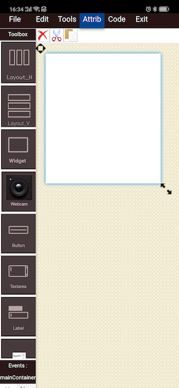
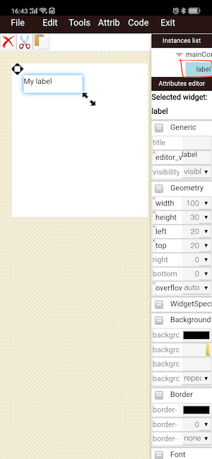
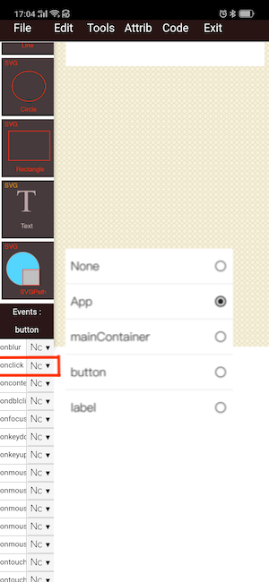
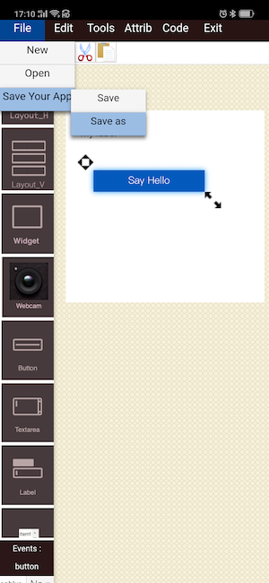
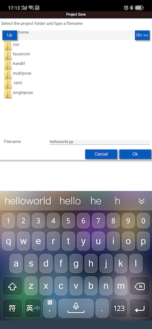
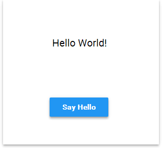

# Wizard--触摸拖拽式设计你的界面


该**Wizard_app**让您在手机上触摸拖拽式图形设计GUI界面。

您可以从组件工具箱（在屏幕左侧）中，选择要添加到界面的UI组件。选择一个组件，您必须填写分配该组件所需的一些字段。除了构造函数参数之外，还需要一些其他信息：

*   **变量名称**：将用于生成应用程序代码的标识符;
*   **重载基类**标志：定义变量是否必须是将重载基类的新类的实例。

在屏幕的右侧，是选中的UI组件的参数面版。它包含属性和样式。可以通过单击选择窗口组件。选择窗口小部件后，可以通过参数面板对其进行自定义。

你要自由添加你的组件，你首先要定义一个或多个容器。目前有三种类型的容器可供选择：

*  **Widget****：允许绝对定位的通用容器;
*   **HBox，VBox**：两种布局都是自动对齐（水平方向对齐和竖直方向对齐）的容齐。

通过使用Widget容器，您可以手动调整大小和拖动小组件。

HBox和VBox容器**不允许**手动拖动和调整窗口小部件的大小。但是可以通过正确的参数面板调整窗口组件的大小。

界面设计完成后后，您可以保存应用程序。它将直接生成python代码并保存在py文件中。通过文件菜单你可以**可以重新加载进行编辑**。

保存后，你可以点击菜单中的**code**按钮查看生成的python代码，并可以修改和运行预览界面。

注意：因为手机屏幕显示区域较小，你可以点击菜单中的tools和Attrib进行显示和隐藏左边栏和右边栏。

# 一步一步的例子
现在，让我们创建我们的第一个_Hello World_应用程序。

首先，我们必须先选择一个容器，我们从左侧工具箱中选择Widget组件。这将是我们的主要窗口。在显示的对话框中，我们必须为变量写一个名称。我们将其称为_mainContainer_。


然后，将组件Widget添加到编辑器后，您可以拖动它并调整其大小。



现在，从左侧工具箱中选择Label组件。同样，我们必须为此组件键入变量名称。


然后，我们可以通过单击右侧的选择Label来拖动和调整大小。



我们需要一个Button。由于我们想将它添加到mainContainer，我们必须通过单击右侧的mainContainer来选择这个容器。


之后，单击左侧工具箱中的Button小部件。输入变量名称确定添加后，并拖动和调整大小。


现在，假如已经添加完了所有必需的组件。我们必须将_onclick_事件从按钮连接到监听器，在我们的示例中，监听器将是主App。



完成所有操作后，通过上方菜单栏保存项目。



选择目标文件夹。输入py文件名并确认。



我们现在可以点击菜单中的**code**按钮查看和编辑刚才wizard生成的代码，例如添加点击按钮消息，改变My label的值 为**Hello World**。


生成的代码如下：

```python
# -*- coding: utf-8 -*-


from remi.gui import *


from cvs import *


class untitled(App):
    def __init__(self, *args, **kwargs):
        #DON'T MAKE CHANGES HERE, THIS METHOD GETS OVERWRITTEN WHEN SAVING IN THE EDITOR
        if not 'editing_mode' in kwargs.keys():
            super(untitled, self).__init__(*args, static_file_path={'my_res':'./res/'})

    def idle(self):
        #idle function called every update cycle
        pass
    
    def main(self):
        return untitled.construct_ui(self)
        
    @staticmethod
    def construct_ui(self):
        #DON'T MAKE CHANGES HERE, THIS METHOD GETS OVERWRITTEN WHEN SAVING IN THE EDITOR
        mainContainer = Widget()
        mainContainer.attributes.update({"editor_baseclass":"Widget","editor_tag_type":"widget","editor_newclass":"False","editor_constructor":"()","class":"Widget","editor_varname":"mainContainer"})
        mainContainer.style.update({"width":"266px","position":"absolute","top":"61px","left":"16px","margin":"0px","overflow":"auto","height":"257px"})
        button = Button('Say Hello')
        button.attributes.update({"editor_baseclass":"Button","editor_tag_type":"widget","editor_newclass":"False","editor_constructor":"('Say Hello')","class":"Button","editor_varname":"button"})
        button.style.update({"width":"149px","position":"absolute","top":"80px","left":"37px","margin":"0px","overflow":"auto","height":"29px"})
        mainContainer.append(button,'button')
        label = Label('My label')
        label.attributes.update({"editor_baseclass":"Label","editor_tag_type":"widget","editor_newclass":"False","editor_constructor":"('My label')","class":"Label","editor_varname":"label"})
        label.style.update({"width":"98px","position":"absolute","top":"20px","left":"20px","margin":"0px","overflow":"auto","height":"25px"})
        mainContainer.append(label,'label')
        mainContainer.children['button'].onclick.do(self.onclick_button)
        

        self.mainContainer = mainContainer
        return self.mainContainer
    
    def onclick_button(self, emitter):
        self.mainContainer.children['label'].set_text('hello world')
        pass


if __name__ == "__main__":
    
    initcv(cvs.openwin)
    startcv(untitled)

```

再次保存后，运行界面如下：



# 深入了解原理
请阅读[cvs-强大的图形界面开发包](https://github.com/aidlearning/AidLearning-FrameWork/blob/master/gui_cvs/README.md)
