<p align=center>
	
	<h3 align="center">AidLearning </a></h3>
</p>

  <p align="center">
    Linux+AI+Python+Gui 4in1 Environments Running on the Android . <a href='intr.md'>[中文版]</a> <a href='README.md'>[English]
  </p>
  <p align="center">
    <a href="https://travis-ci.org/lc-soft/LCUI"></a>
    
    <a href="http://opensource.org/licenses/MIT"></a>
    <a href="https://github.com/aidlearning/AidLearning-FrameWork/releases">
     </a>
    
    


	
  </p>
</p>

### 介绍
AidLearning App在Android手机上构建了一个带图形界面的Linux系统(不需要root)，和你的Android系统共生共存，并内置了目前排名top7的深度学习框架包括Caffe、Tensorflow、Mxnet、pytorch、keras、ncnn、opencv，你不再需要复杂的配置和翻墙安装依赖包。

AidLearning同时是一款口袋AI编程工具，内置的AiCode可视化编程器，可以让你在手机上用python（同时支持Python2和Python3）轻松零基础编程，支持触摸拖拽式界面设计 ，支持代码实时调试和图形化运行。Aid Learning内置大量人脸识别、行为识别、分类等AI源码例子程序，你可以零基础在手机上开发AI App。

此外，Aid Learning提供了基于wifi的映射投屏技术，可以把手机的代码投屏到电脑pc进行web互动编程和SSH远程命令交互，同时也可投影到电视机、投影仪进行大屏显示。

总之，Aid Learning打造了一个Android+Linux+AI 三合一的触摸拖拽式的快速开发和学习平台，不仅可利用手机进行碎片式编程，同时可充分利用两大主流操作系统（Android+Linux）的开发优势和手机的完美终端优势，利用这种优势，Aid Learning打造了一个完美的编程学习和开发的新平台,我们鼓励研究人员和学生利用这些项目来加速 AI 开发和应用。

[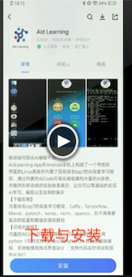](http://www.aidlearning.net/user/aid01.mp4)
[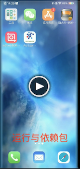](http://www.aidlearning.net/user/aid02.mp4)
[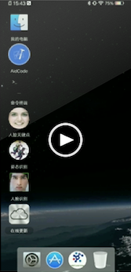](http://www.aidlearning.net/user/aid03.mp4)
[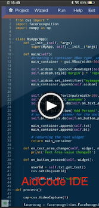](http://www.aidlearning.net/user/aid04.mp4)
[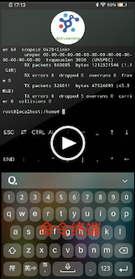](http://www.aidlearning.net/user/aid05.mp4)
[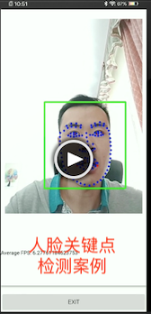](http://www.aidlearning.net/user/aid06.mp4)
[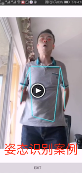](http://www.aidlearning.net/user/aid07.mp4)

### 目录
* <a href='#下载'>⚘ 下载与安装</a>
* <a href='#界面介绍'>⚘ 界面介绍</a>
	* <a href='#我的电脑'>我的电脑与文件管理</a>
	* <a href='#AidCode'>AidCode可视化开发工具</a>
	* <a href='#终端'>命令终端使用</a>
	* <a href='#其他'>其他注意的事情</a>
* <a href='#使用说明'>⚘ 使用说明</a>
	* <a href='#下载安装'>运行后依赖包的安装</a>
	* <a href='#AidCode介绍'>AidCode开发工具介绍</a>
	* <a href='#电脑通过ssh连接'>电脑通过ssh连接</a>
* <a href='#使用样例'>⚘ 使用样例</a>
	* <a href='#运行姿态检测'>运行姿态检测例子</a>
	* <a href='#借助AidCode写HelloWorld'>借助AidCode写HelloWorld</a>

## 下载
可以在各大手机应用市场或者Github上搜索AidLearning下载。
<p align="center">
	
</p>

也可以去 [Github主页](https://github.com/aidlearning/AidLearning-FrameWork)或者[官网](http://www.aidlearning.net)进行下载
## 界面介绍
### 我的电脑
<p align=left>
	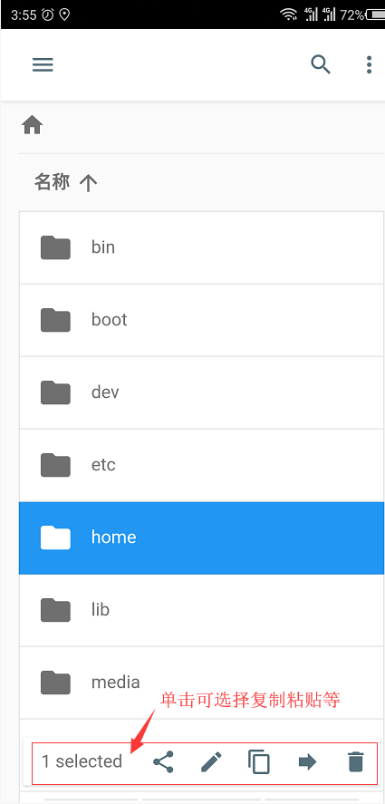
</p>

### AidCode
<p align=left>
	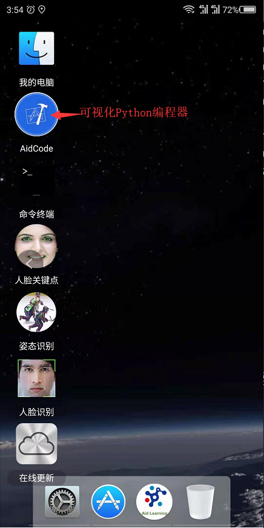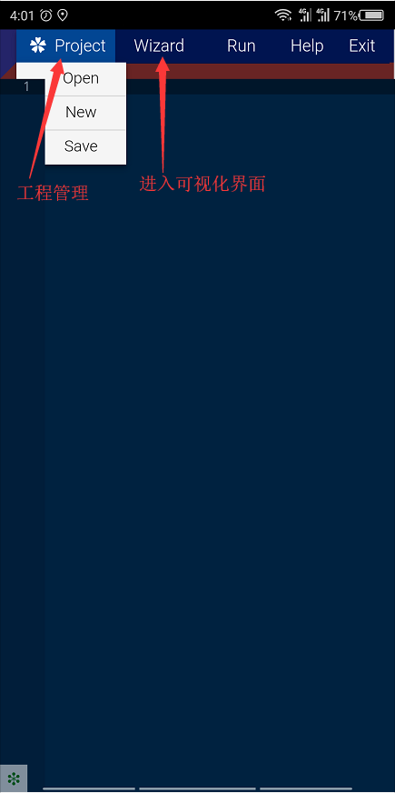
</p>

### 终端
<p align=left>
	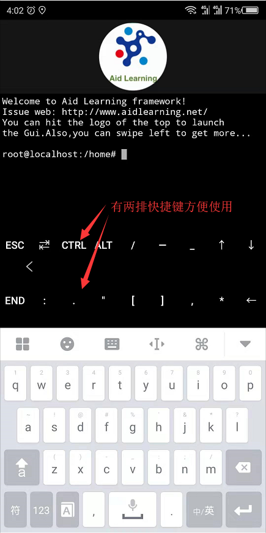
</p>

### 其他
下图右边为更新界面，可以自定义资源包，减少下载时间，后续会有更详细的资源包列表。
<p align=left>
	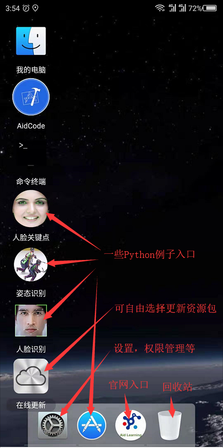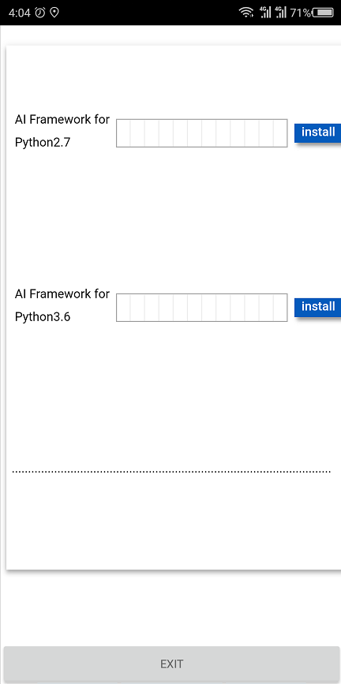
</p>

## 使用说明
### 下载安装
第一次运行程序，会自动下载配置基本资源包
<p align=left>
	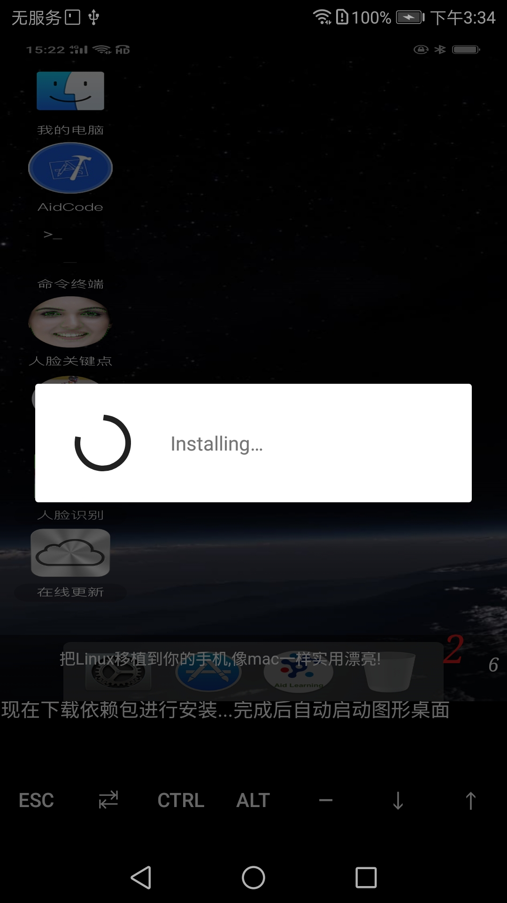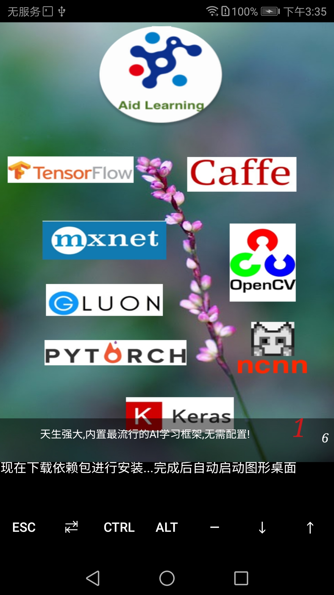
</p>

### AidCode介绍
<p align=left>
	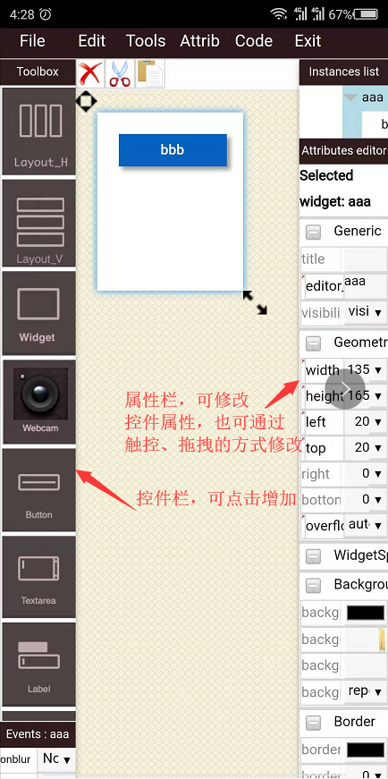
</p>

### 电脑通过ssh连接
首先需要在PC端安装ssh，然后执行**ssh-keygen**生成密钥文件，然后将密钥拷贝到手机即可
<p align=center>
	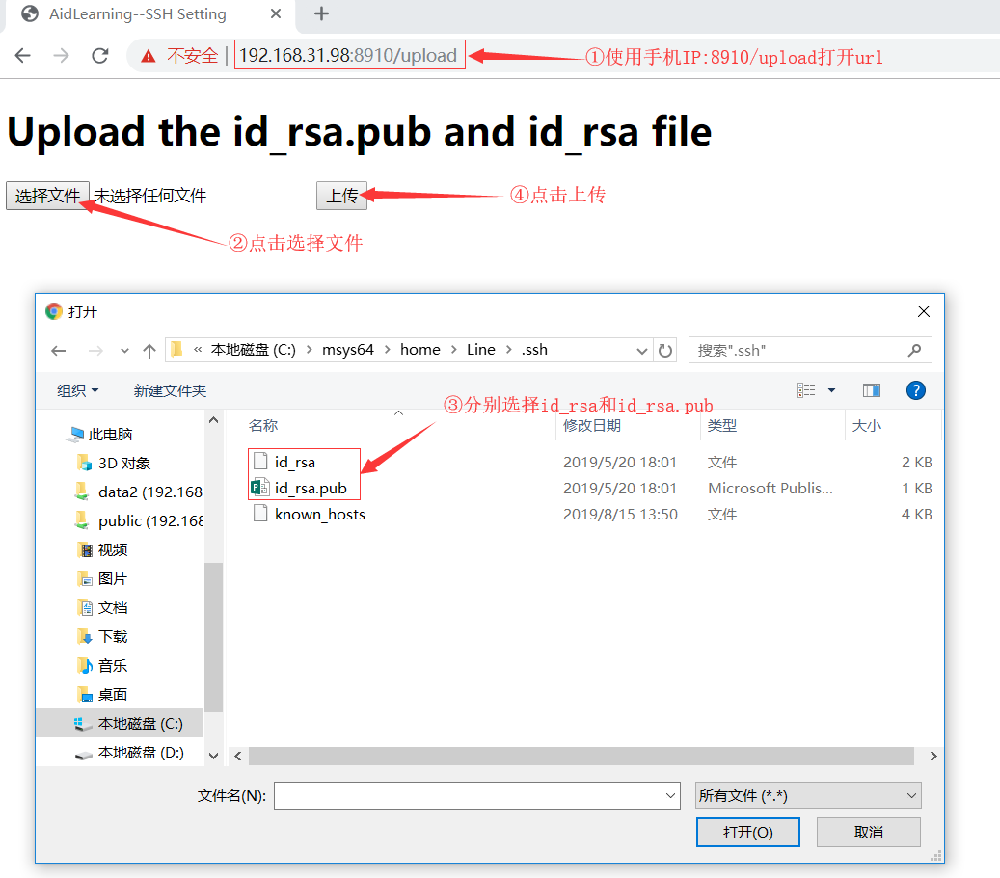
</p>

在PC端就可以通过**ssh u0_a311@手机IP -p8022**连手机进而控制手机了

### 文件传输
AidLearning中的sdcard映射到手机的sdcard，AidLearning与手机之间的文件传输可以通过拷贝到sdcard目录中进行。
<p align=left>
	
</p>

还可以在电脑上使用AidLearning的文件资源管理进行文件传输，通过浏览器访问**http://手机IP:8080/**即可使用AidLearning的文件资源管理
<p align=left>
	
</p>

## 使用样例
### 运行姿态检测
<p align=left>
	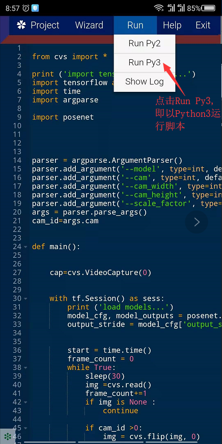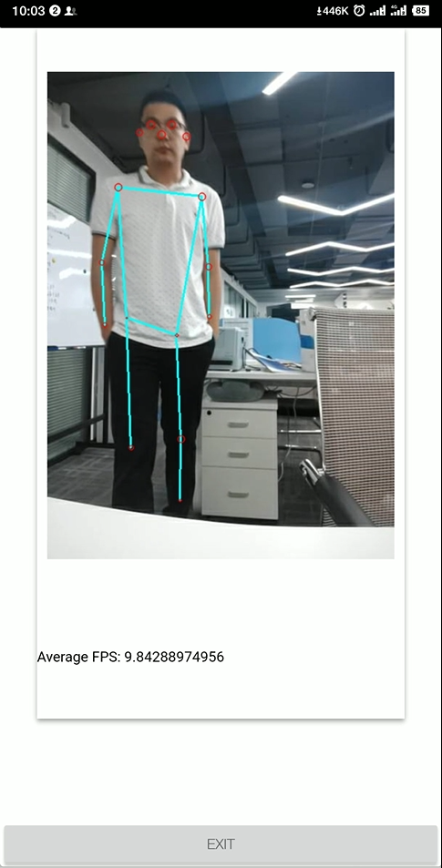
</p>

### 借助AidCode写HelloWorld
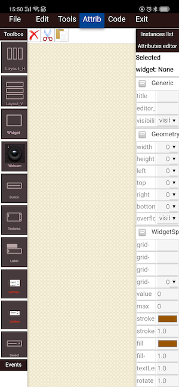

您可以从组件工具箱（在屏幕左侧）中，选择要添加到界面的UI组件。选择一个组件，您必须填写分配该组件所需的一些字段。除了构造函数参数之外，还需要一些其他信息：

*   **变量名称**：将用于生成应用程序代码的标识符;
*   **重载基类**标志：定义变量是否必须是将重载基类的新类的实例。

在屏幕的右侧，是选中的UI组件的参数面版。它包含属性和样式。可以通过单击选择窗口组件。选择窗口小部件后，可以通过参数面板对其进行自定义。

你要自由添加你的组件，你首先要定义一个或多个容器。目前有三种类型的容器可供选择：

*  **Widget****：允许绝对定位的通用容器;
*   **HBox，VBox**：两种布局都是自动对齐（水平方向对齐和竖直方向对齐）的容齐。

通过使用Widget容器，您可以手动调整大小和拖动小组件。

HBox和VBox容器**不允许**手动拖动和调整窗口小部件的大小。但是可以通过正确的参数面板调整窗口组件的大小。

界面设计完成后后，您可以保存应用程序。它将直接生成python代码并保存在py文件中。通过文件菜单你可以**可以重新加载进行编辑**。

保存后，你可以点击菜单中的**code**按钮查看生成的python代码，并可以修改和运行预览界面。

注意：因为手机屏幕显示区域较小，你可以点击菜单中的tools和Attrib进行显示和隐藏左边栏和右边栏。

现在，让我们创建我们的第一个_Hello World_应用程序。

首先，我们必须先选择一个容器，我们从左侧工具箱中选择Widget组件。这将是我们的主要窗口。在显示的对话框中，我们必须为变量写一个名称。我们将其称为_mainContainer_。

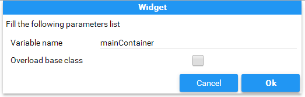

然后，将组件Widget添加到编辑器后，您可以拖动它并调整其大小。


现在，从左侧工具箱中选择Label组件。同样，我们必须为此组件键入变量名称。

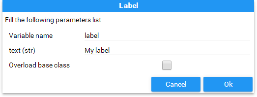

然后，我们可以通过单击右侧的选择Label来拖动和调整大小。


我们需要一个Button。由于我们想将它添加到mainContainer，我们必须通过单击右侧的mainContainer来选择这个容器。


之后，单击左侧工具箱中的Button小部件。输入变量名称确定添加后，并拖动和调整大小。

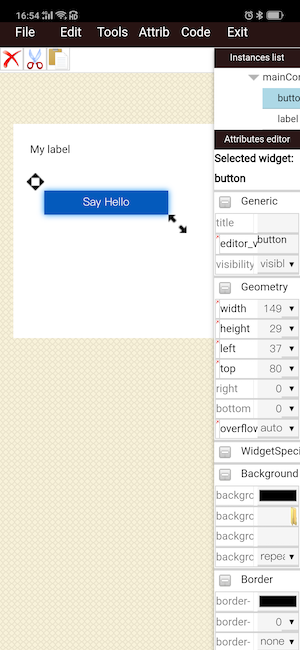

现在，假如已经添加完了所有必需的组件。我们必须将_onclick_事件从按钮连接到监听器，在我们的示例中，监听器将是主App。


完成所有操作后，通过上方菜单栏保存项目。


选择目标文件夹。输入py文件名并确认。


我们现在可以点击菜单中的**code**按钮查看和编辑刚才wizard生成的代码，例如添加点击按钮消息，改变My label的值 为**Hello World**。

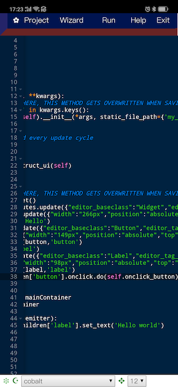

生成的代码如下：

```python
# -*- coding: utf-8 -*-


from remi.gui import *


from cvs import *


class untitled(App):
    def __init__(self, *args, **kwargs):
        #DON'T MAKE CHANGES HERE, THIS METHOD GETS OVERWRITTEN WHEN SAVING IN THE EDITOR
        if not 'editing_mode' in kwargs.keys():
            super(untitled, self).__init__(*args, static_file_path={'my_res':'./res/'})

    def idle(self):
        #idle function called every update cycle
        pass
    
    def main(self):
        return untitled.construct_ui(self)
        
    @staticmethod
    def construct_ui(self):
        #DON'T MAKE CHANGES HERE, THIS METHOD GETS OVERWRITTEN WHEN SAVING IN THE EDITOR
        mainContainer = Widget()
        mainContainer.attributes.update({"editor_baseclass":"Widget","editor_tag_type":"widget","editor_newclass":"False","editor_constructor":"()","class":"Widget","editor_varname":"mainContainer"})
        mainContainer.style.update({"width":"266px","position":"absolute","top":"61px","left":"16px","margin":"0px","overflow":"auto","height":"257px"})
        button = Button('Say Hello')
        button.attributes.update({"editor_baseclass":"Button","editor_tag_type":"widget","editor_newclass":"False","editor_constructor":"('Say Hello')","class":"Button","editor_varname":"button"})
        button.style.update({"width":"149px","position":"absolute","top":"80px","left":"37px","margin":"0px","overflow":"auto","height":"29px"})
        mainContainer.append(button,'button')
        label = Label('My label')
        label.attributes.update({"editor_baseclass":"Label","editor_tag_type":"widget","editor_newclass":"False","editor_constructor":"('My label')","class":"Label","editor_varname":"label"})
        label.style.update({"width":"98px","position":"absolute","top":"20px","left":"20px","margin":"0px","overflow":"auto","height":"25px"})
        mainContainer.append(label,'label')
        mainContainer.children['button'].onclick.do(self.onclick_button)
        

        self.mainContainer = mainContainer
        return self.mainContainer
    
    def onclick_button(self, emitter):
        self.mainContainer.children['label'].set_text('hello world')
        pass


if __name__ == "__main__":
    
    initcv(cvs.openwin)
    startcv(untitled)

```

再次保存后，运行界面如下：


更多中文资料(https://www.jianshu.com/p/f6ec13ece792)

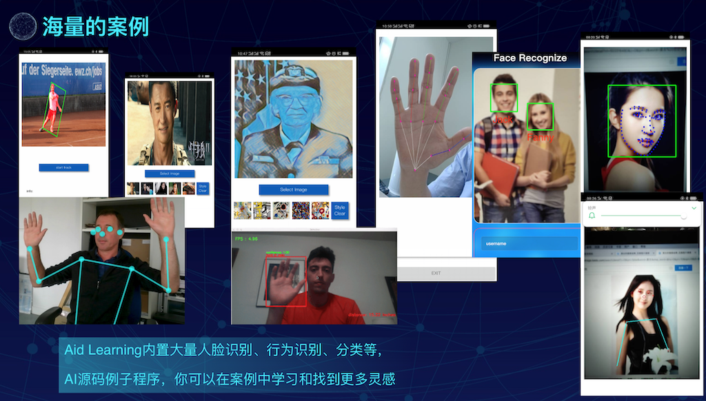

更多例子参考(http://code.aidlearning.net:3000/explore/repos)

<p align=center>
	

</p>
